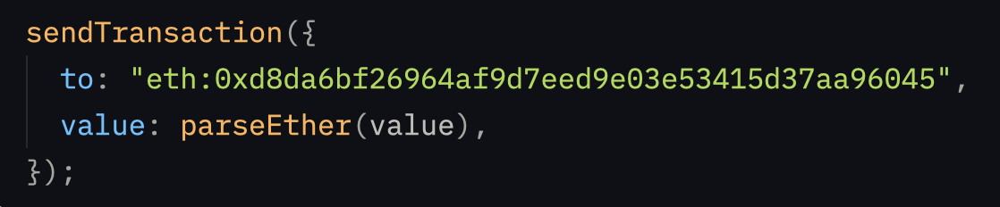
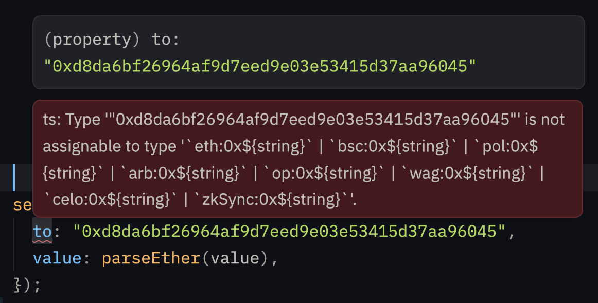

<!-- > [!IMPORTANT] -->
<!-- > Wagmi is participating in Gitcoin Grants round 21. Consider <a href="https://explorer.gitcoin.co/#/round/42161/389/74">supporting the project</a>. Thank you. 🙏 -->

# Wagmi [ERC-3770](https://eips.ethereum.org/EIPS/eip-3770) implementation

This is a fork of the [official wagmi typescript package](https://github.com/wevm/wagmi) which implements support for [ERC-3770](https://eips.ethereum.org/EIPS/eip-3770) address typing and verification.

## Installation

```shell
npm install wagmi-erc-3770
```

## Abstract

This npm package is a much needed interoperability dev tool for dapps developers. It allows for very easy use of chain-specific addresses (introduced by [ERC-3770](https://eips.ethereum.org/EIPS/eip-3770)) for all dapp developers directly integrated into your favorite dapp development tool, [wagmi](https://github.com/wevm/wagmi).

ERC-3770 proposed to add a chain-specific prefix in front of addresses (ex: eth:0xd8da6bf26964af9d7eed9e03e53415d37aa96045)

It  allows dapp developers to use chain-specific addresses in their UX to make sure that no funds would be sent to the wrong chain.

## Problem

In an increasingly multi EVM chain world, sending tokens to an address but on the wrong chain, It can quickly result in user inconvenience, prolonged resolution time or worse, lost funds.

It's actually quite easy to see this problem with your own eyes.

1. Find a popular DeFi contract (let's take [UniswapV3Router on ethereum](https://etherscan.io/address/0xE592427A0AEce92De3Edee1F18E0157C05861564))
2. Let's look at the [address on Base](https://basescan.org/address/0xe592427a0aece92de3edee1f18e0157c05861564)
3. There is no contract deployed there, but you can see that the address holds 2.11 ETH, this is lost funds from unfortunate users who were victim of a bug from the dapp (or wallet). It's the uge issue as there are more than 4,800 transactions pointing to this address on base alone.

To better understand the issue here, most of the time, it comes from dapps that poorly verify that the wallet is connected to the right chain. Some edge cases sometimes allow sending transaction data - which don't specify the chain - to the wallet, in order to be signed and executed.

This is a dapp development issue that could be mitigated with better dev tooling.

## Solution

We made this dev tool available by implementing ERC3770 **compile-time type validation** and **runtime chain-specific address verification** directly inside your beloved wagmi npm package.

### Features

1. Optionnaly activate chain-specific addresses
```ts
createConfig({
  chains: [mainnet, sepolia, optimism],
  connectors: [
    injected(),
  ],
  chainSpecificAddresses: true, // here
})
```

2. Send transaction will validate the type of the `to` destination
```ts
sendTransaction({
  to, // here
  value: parseEther(value)
});
```

  to is valid here
  

  but not valid here
  

## Vision

Next steps would be the following:
- expand ERC-3770 support to all wagmi hooks
- get in touch with the wagmi maintainers and ERC-3770 proposers to make an official OSS contribution to wagmi
- make the same implementation into viem and other popular libraries

## Authors

Built during the AlephDeVerano - A global hybrid event empowering blockchain innovation from Argentina, fostering impactful projects and collaboration across the Web3 ecosystem.
- [Tasneem Toolba](https://github.com/tasneemtoolba)
- [Pybast](https://github.com/pybast)

# Official README

<br>

<p align="center">
  <a href="https://wagmi.sh">
    <picture>
      <source media="(prefers-color-scheme: dark)" srcset="https://raw.githubusercontent.com/wevm/wagmi/main/.github/logo-dark.svg">
      
    </picture>
  </a>
</p>

<p align="center">
  Reactive primitives for Ethereum apps
<p>

<p align="center">
  <a href="https://www.npmjs.com/package/wagmi">
    <picture>
      <source media="(prefers-color-scheme: dark)" srcset="https://img.shields.io/npm/v/wagmi?colorA=21262d&colorB=21262d">
      
    </picture>
  </a>
  <a href="https://github.com/wevm/wagmi/blob/main/LICENSE">
    <picture>
      <source media="(prefers-color-scheme: dark)" srcset="https://img.shields.io/npm/l/wagmi?colorA=21262d&colorB=21262d">
      
    </picture>
  </a>
  <a href="https://www.npmjs.com/package/wagmi">
    <picture>
      <source media="(prefers-color-scheme: dark)" srcset="https://img.shields.io/npm/dm/@wagmi/core?colorA=21262d&colorB=21262d">
      
    </picture>
  </a>
  <a href="https://bestofjs.org/projects/wagmi">
    <picture>
      <source media="(prefers-color-scheme: dark)" srcset="https://img.shields.io/endpoint?colorA=21262d&colorB=21262d&url=https://bestofjs-serverless.now.sh/api/project-badge?fullName=wevm%2Fviem%26since=daily">
      
    </picture>
  </a>
  <a href="https://app.codecov.io/gh/wevm/wagmi">
    <picture>
      <source media="(prefers-color-scheme: dark)" srcset="https://img.shields.io/codecov/c/github/wevm/wagmi?colorA=21262d&colorB=21262d">
      
    </picture>
  </a>
</p>

---

## Documentation

For documentation and guides, visit [wagmi.sh](https://wagmi.sh).

## Community

For help, discussion about best practices, or any other conversation that would benefit from being searchable:

[Discuss Wagmi on GitHub](https://github.com/wevm/wagmi/discussions)

For casual chit-chat with others using the framework:

[Join the Wagmi Discord](https://discord.gg/SghfWBKexF)

## Contributing

Contributions to Wagmi are greatly appreciated! If you're interested in contributing to Wagmi, please read the [Contributing Guide](https://wagmi.sh/dev/contributing) **before submitting a pull request**.

## Sponsors

If you find Wagmi useful or use it for work, please consider [sponsoring Wagmi](https://github.com/sponsors/wevm?metadata_campaign=gh_readme_support). Thank you 🙏

<p>
  <a href="https://paradigm.xyz">
    <picture>
      <source media="(prefers-color-scheme: dark)" srcset="https://raw.githubusercontent.com/wevm/.github/main/content/sponsors/paradigm-dark.svg">
      
    </picture>
  </a>
  <a href="https://ithaca.xyz">
    <picture>
      <source media="(prefers-color-scheme: dark)" srcset="https://raw.githubusercontent.com/wevm/.github/main/content/sponsors/ithaca-dark.svg">
      
    </picture>
  </a>
</p>

<p>
  <a href="https://twitter.com/family">
    <picture>
      <source media="(prefers-color-scheme: dark)" srcset="https://raw.githubusercontent.com/wevm/.github/main/content/sponsors/family-dark.svg">
      
    </picture>
  </a>
  <a href="https://twitter.com/context">
    <picture>
      <source media="(prefers-color-scheme: dark)" srcset="https://raw.githubusercontent.com/wevm/.github/main/content/sponsors/context-dark.svg">
      
    </picture>
  </a>
  <a href="https://walletconnect.com">
    <picture>
      <source media="(prefers-color-scheme: dark)" srcset="https://raw.githubusercontent.com/wevm/.github/main/content/sponsors/walletconnect-dark.svg">
      
    </picture>
  </a>
  <a href="https://twitter.com/prtyDAO">
    <picture>
      <source media="(prefers-color-scheme: dark)" srcset="https://raw.githubusercontent.com/wevm/.github/main/content/sponsors/partydao-dark.svg">
      
    </picture>
  </a>
  <a href="https://dynamic.xyz">
    <picture>
      <source media="(prefers-color-scheme: dark)" srcset="https://raw.githubusercontent.com/wevm/.github/main/content/sponsors/dynamic-dark.svg">
      
    </picture>
  </a>
  <a href="https://sushi.com">
    <picture>
      <source media="(prefers-color-scheme: dark)" srcset="https://raw.githubusercontent.com/wevm/.github/main/content/sponsors/sushi-dark.svg">
      
    </picture>
  </a>
  <a href="https://stripe.com">
    <picture>
      <source media="(prefers-color-scheme: dark)" srcset="https://raw.githubusercontent.com/wevm/.github/main/content/sponsors/stripe-dark.svg">
      
    </picture>
  </a>
  <a href="https://www.privy.io">
    <picture>
      <source media="(prefers-color-scheme: dark)" srcset="https://raw.githubusercontent.com/wevm/.github/main/content/sponsors/privy-dark.svg">
      
    </picture>
  </a>
  <a href="https://pancakeswap.finance/">
    <picture>
      <source media="(prefers-color-scheme: dark)" srcset="https://raw.githubusercontent.com/wevm/.github/main/content/sponsors/pancake-dark.svg">
      
    </picture>
  </a>
  <a href="https://celo.org">
    <picture>
      <source media="(prefers-color-scheme: dark)" srcset="https://raw.githubusercontent.com/wevm/.github/main/content/sponsors/celo-dark.svg">
      
    </picture>
  </a>
  <a href="https://rainbow.me">
    <picture>
      <source media="(prefers-color-scheme: dark)" srcset="https://raw.githubusercontent.com/wevm/.github/main/content/sponsors/rainbow-dark.svg">
      
    </picture>
  </a>
  <a href="https://pimlico.io">
    <picture>
      <source media="(prefers-color-scheme: dark)" srcset="https://raw.githubusercontent.com/wevm/.github/main/content/sponsors/pimlico-dark.svg">
      
    </picture>
  </a>
  <a href="https://zora.co">
    <picture>
      <source media="(prefers-color-scheme: dark)" srcset="https://raw.githubusercontent.com/wevm/.github/main/content/sponsors/zora-dark.svg">
      
    </picture>
  </a>
  <a href="https://lattice.xyz">
    <picture>
      <source media="(prefers-color-scheme: dark)" srcset="https://raw.githubusercontent.com/wevm/.github/main/content/sponsors/lattice-dark.svg">
      
    </picture>
  </a>
  <a href="https://twitter.com/supafinance">
    <picture>
      <source media="(prefers-color-scheme: dark)" srcset="https://raw.githubusercontent.com/wevm/.github/main/content/sponsors/supa-dark.svg">
      
    </picture>
  </a>
  <a href="https://zksync.io">
    <picture>
      <source media="(prefers-color-scheme: dark)" srcset="https://raw.githubusercontent.com/wevm/.github/main/content/sponsors/zksync-dark.svg">
      
    </picture>
  </a>
  <a href="https://syndicate.io">
    <picture>
      <source media="(prefers-color-scheme: dark)" srcset="https://raw.githubusercontent.com/wevm/.github/main/content/sponsors/syndicate-dark.svg">
      
    </picture>
  </a>
  <a href="https://reservoir.tools">
    <picture>
      <source media="(prefers-color-scheme: dark)" srcset="https://raw.githubusercontent.com/wevm/.github/main/content/sponsors/reservoir-dark.svg">
      
    </picture>
  </a>
  <a href="https://brave.com">
    <picture>
      <source media="(prefers-color-scheme: dark)" srcset="https://raw.githubusercontent.com/wevm/.github/main/content/sponsors/brave-dark.svg">
      
    </picture>
  </a>
  <a href="https://linea.build">
    <picture>
      <source media="(prefers-color-scheme: dark)" srcset="https://raw.githubusercontent.com/wevm/.github/main/content/sponsors/linea-dark.svg">
      
    </picture>
  </a>
  <a href="https://uniswap.org">
    <picture>
      <source media="(prefers-color-scheme: dark)" srcset="https://raw.githubusercontent.com/wevm/.github/main/content/sponsors/uniswap-dark.svg">
      
    </picture>
  </a>
  <a href="https://biconomy.io">
    <picture>
      <source media="(prefers-color-scheme: dark)" srcset="https://raw.githubusercontent.com/wevm/.github/b0276d897be98a4c94ad1d1c72ce99a1020eeb58/content/sponsors/biconomy-dark.svg">
      
    </picture>
  </a>
  <a href="https://thirdweb.com">
    <picture>
      <source media="(prefers-color-scheme: dark)" srcset="https://raw.githubusercontent.com/wevm/.github/main/content/sponsors/thirdweb-dark.svg">
      
    </picture>
  </a>
  <a href="https://uxuy.com">
    <picture>
      <source media="(prefers-color-scheme: dark)" srcset="https://raw.githubusercontent.com/wevm/.github/main/content/sponsors/uxuy-dark.svg">
      
    </picture>
  </a>
  <a href="https://polymarket.com">
    <picture>
      <source media="(prefers-color-scheme: dark)" srcset="https://raw.githubusercontent.com/wevm/.github/main/content/sponsors/polymarket-dark.svg">
      
    </picture>
  </a>
  <a href="https://routescan.io">
    <picture>
      <source media="(prefers-color-scheme: dark)" srcset="https://raw.githubusercontent.com/wevm/.github/main/content/sponsors/routescan-dark.svg">
      
    </picture>
  </a>
</p>

[Sponsor Wagmi](https://github.com/sponsors/wevm?metadata_campaign=gh_readme_support_bottom)

<br />
<br />
